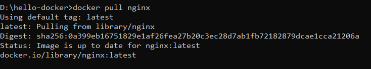
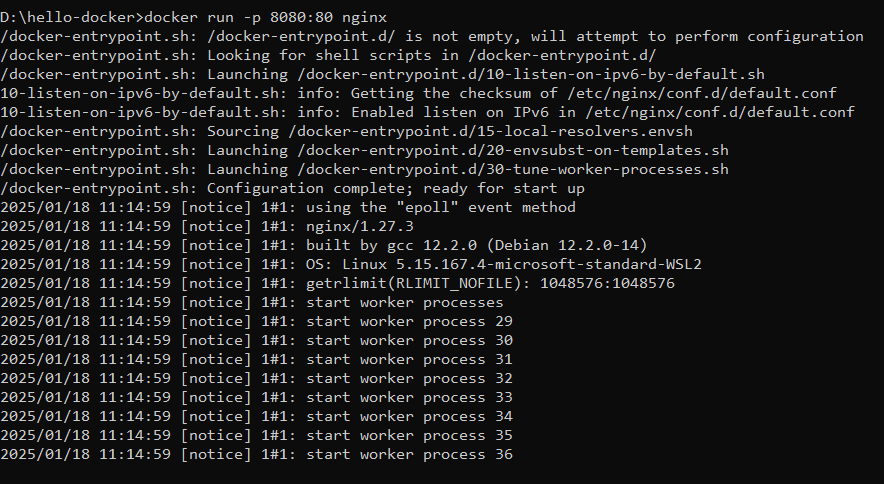
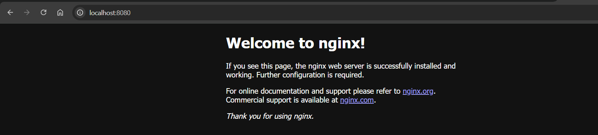
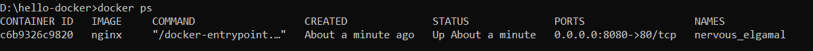
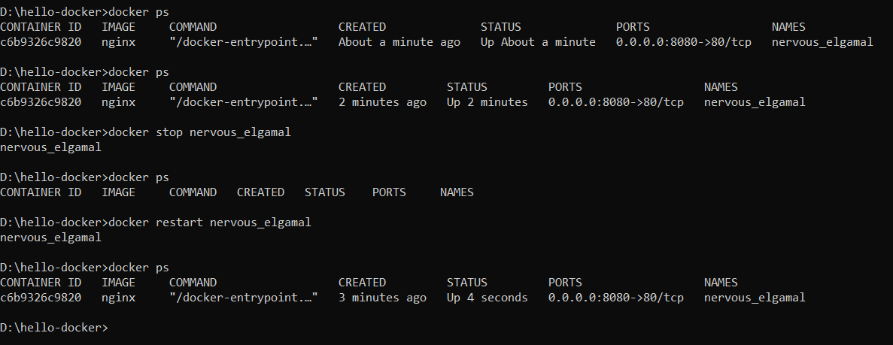
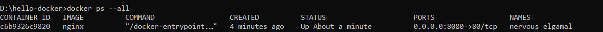
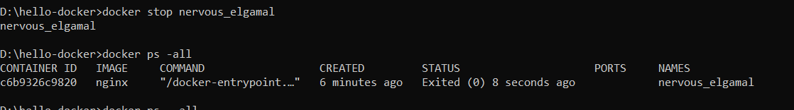
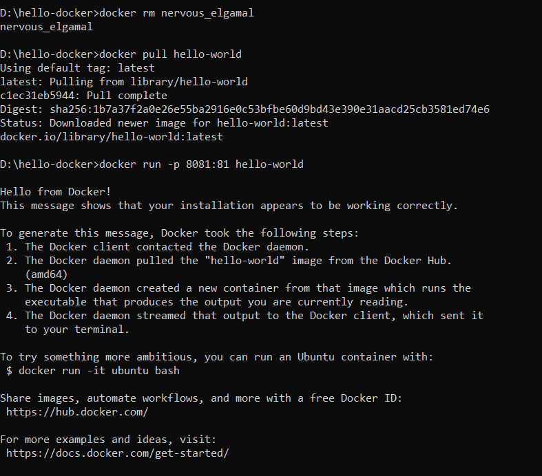

# Docker Commands and Outputs

This document includes the commands used along with descriptions and corresponding output screenshots.

## Step 1
Pull the nginx image from Docker Hub..

## Step 2
Run a container with the nginx image. "-p" maps the port 8080 of the host to port 80 of the container(runs in isolation). 

## Step 3
Visit the default webpage https://localhost:8080. 

## Step 4
List the running containers.

## Step 5
Stop the conatiner and then restart it. We observe that the up time is not reset.

## Step 6
The container is running.

## Step 7
The conatiner is stopped by passing the name of the conatiner as the argument.

## Step 8
Pull the hello-world image and run it. We see a message on the command line saying that we had successfully installed the docker. 

