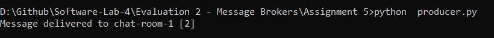

# Real-Time Messaging System using Kafka

## Objective
Build a real-time messaging system using Apache Kafka.

## Features
- Users can join chat rooms.
- Users can send messages to specific chat rooms.
- Multiple consumers receive messages in real-time.
- Dynamic joining and leaving of chat rooms.
- Partitioning to manage different chat rooms efficiently.

## Components
### Producer (Message Sender)
- Simulates a user sending messages to a specific chat room.
- Publishes messages to Kafka topics (each topic represents a chat room).

### Consumer (Message Receiver)
- Multiple consumers subscribe to a chat room.
- Receives messages in real time from Kafka topics.

## Implementation

### Step 1: Set Up Kafka
Follow Assignment 1

### Step 2: Create Kafka Topics for Chat Rooms
```bash
.\bin\windows\kafka-topics.bat --create --topic chat-room-1 --bootstrap-server localhost:9092 --partitions 3 --replication-factor 1
```

### Step 3: Implement the Producer (Message Sender)
Use Python and Kafka's `confluent-kafka` library to produce messages:
```python
from confluent_kafka import Producer

def delivery_report(err, msg):
    if err:
        print(f"Message delivery failed: {err}")
    else:
        print(f"Message delivered to {msg.topic()} [{msg.partition()}]")

producer = Producer({'bootstrap.servers': 'localhost:9092'})

def send_message(chat_room, message):
    producer.produce(chat_room, message.encode('utf-8'), callback=delivery_report)
    producer.flush()

# Example Usage
send_message("chat-room-1", "Hello, Kafka Chat!")
```

### Step 4: Implement the Consumer (Message Receiver)
```python
from confluent_kafka import Consumer

consumer = Consumer({
    'bootstrap.servers': 'localhost:9092',
    'group.id': 'chat-consumers',
    'auto.offset.reset': 'earliest'
})

chat_room = "chat-room-1"
consumer.subscribe([chat_room])

while True:
    msg = consumer.poll(1.0)
    if msg is None:
        continue
    if msg.error():
        print(f"Consumer error: {msg.error()}")
        continue
    print(f"Received message: {msg.value().decode('utf-8')}")
```

## Images



## Conclusion
By leveraging Kafka's real-time messaging capabilities, we built a scalable chat system where users can send and receive messages dynamically. Further improvements can include WebSocket integration for frontend applications.